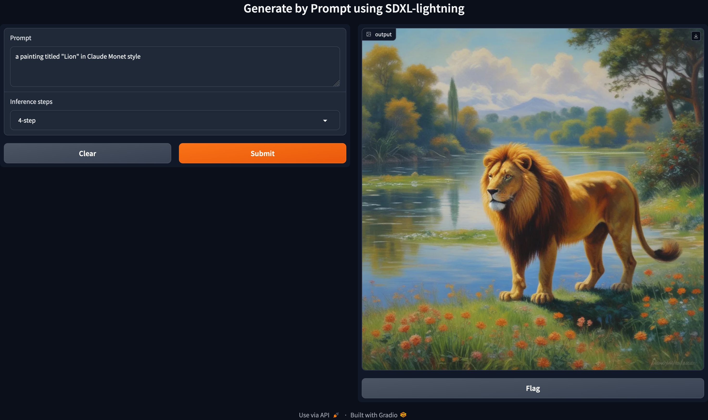

# Generating by Prompts using SDXL-lightning

## Introduction

We create a module that generates images by user-defined (text) prompts. As a model, we utilize the pretrained version of [Stable Diffusion XL-lightning](https://arxiv.org/abs/2402.13929) provided by [ByteDance at HuggingFace](https://huggingface.co/ByteDance/SDXL-Lightning).

## Setting Up the Environment

### Using Conda (recommended)

### Using pip

## Generating Images

Check it out how to use

~~~
python3 generate.py --help
~~~

Output:

~~~
Generate images by prompts using SDXL-lightning

positional arguments:
  prompt                Text prompt that be used for generating

options:
  -h, --help            show this help message and exit
  --step_choice {1-step,2-step,4-step,8-step}
                        Step choice for inference. Default: '4-step'
  --scheduler_name SCHEDULER_NAME
                        Scheduler name for inference. Default: 'euler_discrete_scheduler'
  --device {cuda,mps,cpu}
                        GPU device that be used during inference. Default: None
~~~

### Example usages

~~~
python3 generate.py\
 "an image of a turtle in Camille Pissaro style"\
 --step_choice 2-step
~~~
~~~
python3 generate.py\
 "an image of a turtle in Picasso style"\
 --step_choice 2-step
~~~

The output images seen below (left: Picasso style, right: Pissarro style) will be saved into `./generated-images` folder.

  
  

## Generating Images by Gradio

To run the gradio app on your local computer, execute:

~~~
python3 app.py
~~~
Then, visit the url [http://127.0.0.1:7860](http://127.0.0.1:7860) to open the interface.

### Example usage

See the display below for an example usage of the module via Gradio for the prompt `'a painting titled "Lion" in Claude Monet style'` with `inference steps` of 4.

  

